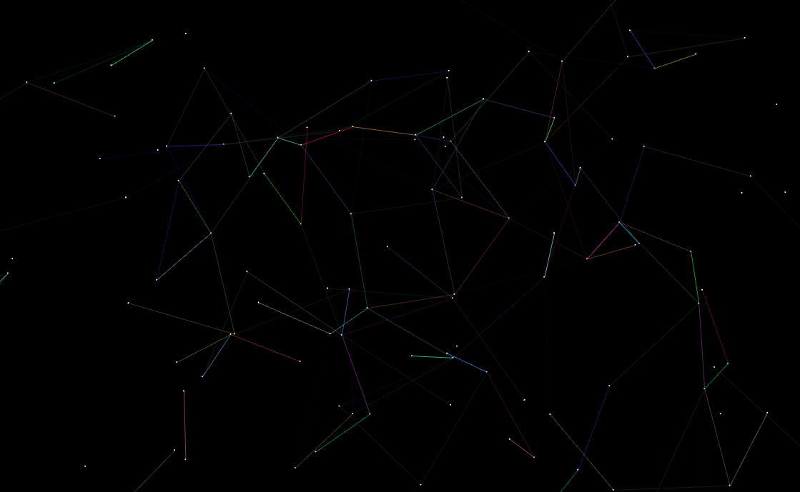

# GiantComponent

GiantComponent is a Javascript module built using [PIXI.js](http://www.pixijs.com/) to visualize a Giant Component graph. A random completely disconnected graph is generated with moving vertices and edges. Each rendering frame a new edge is added until the graph is complete. Edges are only visible once they are within the user defined threshold length. Project was inspired by the [Ex Machina](http://exmachina-movie.com/) movie website background.

## Usage

### Download
        
        git clone https://github.com/sunjayBhatia/GiantComponent.git
        cd GiantComponent

--

### API

#### Constructor:
**Description:** builds `GiantComponent` object

**Example:** `var gc = new GiantComponent(options)`

**Options:**

`DOMParent`: DOM element to append giant component rendering area

`width`: integer, width of rendering area

`height`: integer, height of rendering area

`vertexRad`: number, radius of vertex

`numVertices`: integer, number of vertices rendered

`vertexColor`: function, vertex color

`vertexMaxSpeed`: number, max speed of vertices when moused over

`vertexMouseSensitivity`: number, increases mouse over area

`edgeWidth`: number, width of edges

`edgeThreshold`: number, maximum length of visibility for edges

`edgeColor`: function, edge color

#### start:
**Description:** start the giant component animation

**Example:** `gc.start()`

#### pause:
**Description:** pause the giant component animation

**Example:** `gc.pause()`
 
#### unpause:
**Description:** unpause the giant component animation

**Example:** `gc.unpause()`

#### end:
**Description:** stop and clear the giant component animation

**Example:** `gc.end()`

--

### View Example

Serve directory with the following command:

        python -m SimpleHTTPServer

Navigate in browser to `localhost:8000/example`